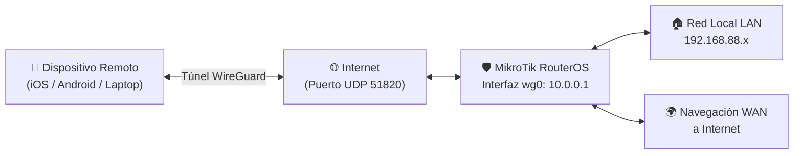

# Servidor VPN WireGuard en RouterOS

> [!abstract] Resumen
> Guía completa para implementar un servidor VPN WireGuard nativo en routers MikroTik con RouterOS v7 (como el hAP ax² o similares). Permite conectar de forma segura dispositivos remotos (iOS, Android, Linux, macOS) a la red local doméstica y canalizar el tráfico a Internet mediante túnel cifrado de alto rendimiento.

> [!info] Ventajas de WireGuard nativo en RouterOS vs contenedor Proxmox/LXC
> A diferencia de desplegar WireGuard en un servidor interno o contenedor LXC, configurarlo directamente en el router elimina la necesidad de abrir puertos hacia hosts intermedios (*port-forwarding*), simplifica el enrutamiento directo hacia la subred LAN (`192.168.88.0/24`) y aprovecha la aceleración por hardware de RouterOS v7.

---

## 1. Modelo de arquitectura de red



- **Subred VPN dedicada:** `10.0.0.0/24` (aislada de la LAN interna `192.168.88.0/24`).
- **IP del Servidor MikroTik en el túnel:** `10.0.0.1/24`.
- **Puerto de escucha:** `51820/UDP`.

---

## 2. Configuración del Servidor en MikroTik (RouterOS v7)

Ejecuta los siguientes comandos en la **Terminal** de RouterOS (mediante Winbox, WebFig o SSH):

### 2.1. Crear la interfaz WireGuard

```routeros
/interface wireguard add name=wg0 listen-port=51820 comment="Servidor VPN WireGuard"
```

### 2.2. Asignar direccionamiento IP a la interfaz VPN

```routeros
/ip address add address=10.0.0.1/24 interface=wg0 network=10.0.0.0 comment="Subred WireGuard"
```

### 2.3. Habilitar regla de Firewall (Tráfico de entrada)

Permite que el router reciba peticiones en el puerto `51820/UDP`.

```routeros
/ip firewall filter add chain=input protocol=udp dst-port=51820 action=accept comment="Permitir WireGuard VPN" place-before=0
```

> [!warning] Posición de la regla en el Firewall
> La regla debe situarse por delante de cualquier regla que descarte tráfico entrante no solicitado (`action=drop chain=input`). El parámetro `place-before=0` la coloca al inicio de la cadena.

### 2.4. Regla de enmascaramiento NAT para salida a Internet

Permite que el tráfico procedente de la VPN (`10.0.0.0/24`) pueda navegar a Internet a través de la interfaz WAN:

```routeros
/ip firewall nat add chain=srcnat src-address=10.0.0.0/24 out-interface=ether1 action=masquerade comment="NAT WireGuard a Internet"
```

*(Si tu interfaz WAN no es `ether1`, sustitúyela por el nombre de tu puerto WAN o `out-interface-list=WAN`).*

---

## 3. Obtención de la clave pública y DDNS

### 3.1. Clave pública del router

```routeros
/interface wireguard print
```

Copia el valor del campo `public-key` de la interfaz `wg0` (ejemplo: `aBc123XyZ456...=`). Será requerida para configurar cada cliente.

### 3.2. Dominio dinámico (MikroTik Cloud DDNS)

Si tu conexión cuenta con IP pública dinámica, puedes utilizar el servicio DDNS gratuito incluido en RouterOS:

```routeros
/ip cloud set ddns-enabled=yes
/ip cloud print
```

El campo `dns-name` proporcionará tu dominio permanente (ej. `xxxx.sn.mynetname.net`).

---

## 4. Script automatizado para generación de clientes y códigos QR

Para agilizar la generación de pares de claves, archivos `.conf` y códigos QR para móviles, puedes ejecutar este script en cualquier equipo local con Linux o macOS (`bash`, `wireguard-tools` y `qrencode` requeridos).

```bash
# Instalación de dependencias:
# Debian / Ubuntu: sudo apt install wireguard-tools qrencode -y
# macOS: brew install wireguard-tools qrencode
```

### Script `setup-wg.sh`:

```bash
#!/usr/bin/env bash
# Generador automatizado de perfiles WireGuard para MikroTik RouterOS
set -e

# Lista de identificadores de clientes a generar
DEVICES=("movil-1" "movil-2" "laptop" "servidor-externo")

echo "=========================================="
echo "  Generador de Clientes WireGuard"
echo "=========================================="

# Validar dependencias
for cmd in wg qrencode; do
  if ! command -v "$cmd" >/dev/null 2>&1; then
    echo "Error: herramienta requerida no encontrada: $cmd"
    exit 1
  fi
done

# Parámetros del servidor
read -r -p "Introduce la clave pública del MikroTik: " MIKROTIK_PUBKEY
read -r -p "Introduce la IP pública o dominio DDNS del MikroTik: " ENDPOINT_HOST
ENDPOINT_PORT="51820"

OUTDIR="wg-configs-$(date +%Y%m%d-%H%M%S)"
mkdir -p "$OUTDIR"

MIKROTIK_CMDS=()

for i in "${!DEVICES[@]}"; do
  DEV="${DEVICES[$i]}"
  IP="10.0.0.$((i + 2))"

  # Generación de par de claves cliente
  PRIV_KEY=$(wg genkey)
  PUB_KEY=$(printf '%s' "$PRIV_KEY" | wg pubkey)

  # Creación de archivo .conf
  cat > "$OUTDIR/${DEV}.conf" <<EOF
[Interface]
PrivateKey = $PRIV_KEY
Address = $IP/32
DNS = 1.1.1.1, 8.8.8.8

[Peer]
PublicKey = $MIKROTIK_PUBKEY
Endpoint = $ENDPOINT_HOST:$ENDPOINT_PORT
AllowedIPs = 0.0.0.0/0
PersistentKeepalive = 25
EOF

  # Generación de código QR (imagen PNG y terminal)
  qrencode -t png -o "$OUTDIR/${DEV}.png" < "$OUTDIR/${DEV}.conf"
  
  # Comando CLI para registrar el peer en MikroTik
  MIKROTIK_CMDS+=("/interface wireguard peers add interface=wg0 public-key=\"$PUB_KEY\" allowed-address=$IP/32 comment=\"$DEV\"")
done

# Guardar lote de comandos para RouterOS
printf "%s\n" "${MIKROTIK_CMDS[@]}" > "$OUTDIR/mikrotik-peers-commands.txt"

echo ""
echo "Configuraciones generadas con éxito en: $OUTDIR"
echo "Comandos generados para RouterOS:"
echo "----------------------------------------------------"
cat "$OUTDIR/mikrotik-peers-commands.txt"
```

---

## 5. Registro de Peers en RouterOS

Copia el bloque generado por el script y pégalo en la terminal del router:

```routeros
/interface wireguard peers add interface=wg0 public-key="PUBKEY_MOVIL1" allowed-address=10.0.0.2/32 comment="movil-1"
/interface wireguard peers add interface=wg0 public-key="PUBKEY_MOVIL2" allowed-address=10.0.0.3/32 comment="movil-2"
/interface wireguard peers add interface=wg0 public-key="PUBKEY_LAPTOP" allowed-address=10.0.0.4/32 comment="laptop"
```

Para verificar los peers registrados:

```routeros
/interface wireguard peers print
```

---

## 6. Despliegue en clientes

### Dispositivos móviles (iOS / Android)
1. Instala la app oficial **WireGuard**.
2. Pulsa **+** y selecciona **Escanear código QR**.
3. Escanea la imagen generada (`.png`) o desde la terminal.
4. Asigna un nombre a la conexión y actívala.

### Linux (Debian, Ubuntu, Arch)
1. Instala el paquete WireGuard (`sudo apt install wireguard` o `sudo pacman -S wireguard-tools`).
2. Copia el archivo `.conf` a `/etc/wireguard/wg0.conf`:
   ```bash
   sudo cp laptop.conf /etc/wireguard/wg0.conf
   sudo chmod 600 /etc/wireguard/wg0.conf
   ```
3. Inicia y habilita el túnel:
   ```bash
   sudo wg-quick up wg0
   sudo systemctl enable wg-quick@wg0
   ```

### macOS
- **Vía aplicación gráfica:** Importar el archivo `.conf` en la app oficial de [WireGuard para Mac](https://apps.apple.com/app/wireguard/id1451685025).
- **Vía CLI (`wg-quick`):**
  ```bash
  sudo wg-quick up ./laptop.conf
  ```

---

## 7. Verificación y diagnóstico del túnel

### Comprobación de Handshake en RouterOS

```routeros
/interface wireguard peers print detail
```

> [!tip] Confirmación de enlace activo
> Un túnel funcional muestra el campo `last-handshake` con un valor reciente (ej. `2s`, `45s`) y tráfico acumulado en `rx` y `tx`. Si `last-handshake` está vacío, el cliente no ha establecido contacto con el router.

### Pruebas de conectividad desde el cliente

```bash
# Ping a la interfaz del router en la VPN
ping 10.0.0.1

# Ping a la interfaz LAN del router
ping 192.168.88.1

# Verificación de estado de la interfaz local
sudo wg show
```

---

## 8. Resolución de incidencias comunes

### 1. El túnel no inicia (sin handshake)
- **Operador con CG-NAT:** Si la IP asignada por tu proveedor pertenece al rango `100.64.0.0/10`, estás tras CG-NAT y los paquetes entrantes no llegarán al router. Es necesario solicitar al ISP una dirección IP pública estática o dinámica accesible.
- **Regla de Firewall bloqueada:** Asegúrate de que la regla de `input` en el puerto `51820/udp` está por delante de cualquier regla `drop`.
- **Inconsistencia de claves:** Comprueba que la clave pública registrada en el peer del MikroTik coincide carácter por carácter con la clave pública derivada de la clave privada del cliente.

### 2. Hay handshake pero no hay navegación ni acceso a LAN
- **Falta de regla Masquerade:** Revisa que existe la regla de NAT `/ip firewall nat add chain=srcnat src-address=10.0.0.0/24 action=masquerade`.
- **AllowedIPs en el cliente:** Para canalizar todo el tráfico debe figurar `AllowedIPs = 0.0.0.0/0`. Para modo túnel dividido (*split-tunnel*), incluye solo las redes deseadas (ej. `AllowedIPs = 192.168.88.0/24, 10.0.0.0/24`).

### 3. Operaciones de mantenimiento rápido

```routeros
# Deshabilitar temporalmente el túnel WireGuard
/interface wireguard set wg0 disabled=yes

# Reactivar la interfaz
/interface wireguard set wg0 disabled=no

# Exportar configuración de WireGuard para copia de seguridad
/export file=wireguard-backup.rsc
```
